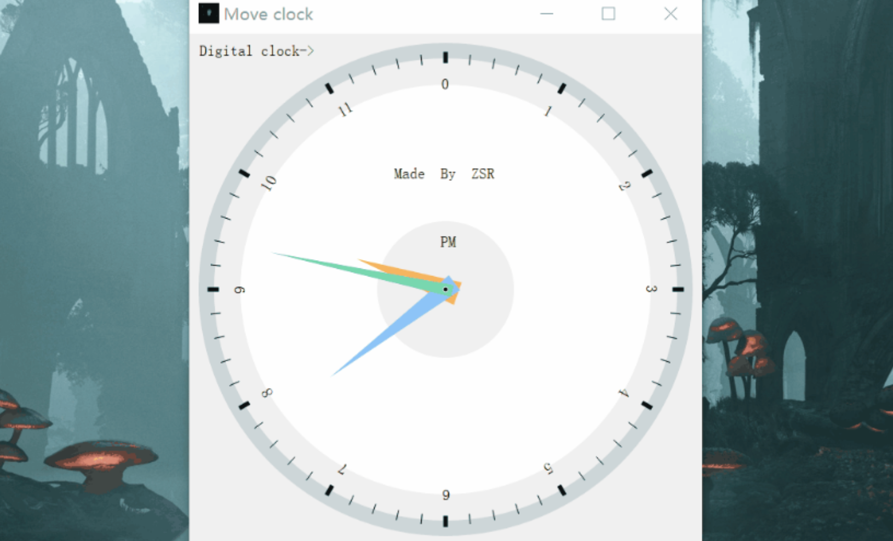

# AutoClock: Qt实现指针式时钟与数字时钟

## 1. 设计概述

本项目包含两个窗口：主窗口（MainWindow）和子窗口（SubWindow）。主窗口用于实现基本的时钟功能，包括指针式时钟的显示和时间的动态更新。子窗口则用于展示数字时钟，以“时:分:秒”的格式显示当前时间。

### 主窗口设计

- **构造函数**：`MainWindow(QWidget *parent = nullptr)`
- **绘制事件**：`void paintEvent(QPaintEvent *)`
  - 使用Qt的时间函数`QTime::currentTime()`获取系统时间。
  - 根据时间绘制时针、分针和秒针。
  - 绘制小时、分钟和秒的刻度线。
  - 使用`scale()`函数实现时钟大小随窗口变化而自适应。
- **子窗口切换函数**：`void dealsub()`
  - 切换到子窗口。
- **主窗口恢复函数**：`void changeback()`
  - 从子窗口切换回主窗口。
- **子窗口声明**：`sub w`
- **按钮声明**：`QPushButton b`

### 子窗口设计

- **构造函数**：`explicit sub(QWidget *parent = nullptr)`
- **发送信号函数**：`void sentsignal()`
- **绘制事件**：`void paintEvent(QPaintEvent *event)`
  - 使用`QTime::currentTime()`获取当前时间。
  - 使用`QLCDNumber`显示数字时钟。
- **信号处理函数**：`void mysignal()`
- **显示时间函数**：`void showtime()`
- **按钮声明**：`QPushButton b1`
- **LCD显示声明**：`QLCDNumber *lcd`

## 2. 用户手册

- **启动程序**：程序启动后，默认显示指针式时钟。
- **切换到数字时钟**：点击“Digital Clock”按钮，切换到数字时钟窗口。
- **切换回指针式时钟**：点击“Move Clock”按钮，返回指针式时钟窗口。

## 3. 运行效果图

